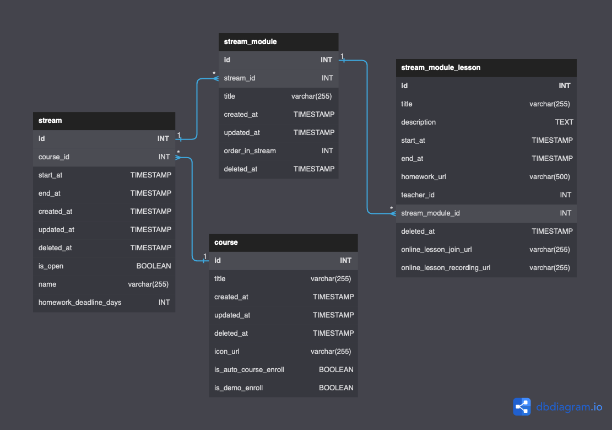

# Тестовое задание на позицию Data Engineer. Выполнил Павел Коротков, tlg: @pvl_ko

## Схема БД-источника




# Выбор методологии хранилища
При выполнении данного тестового задания для выбора методологии DWH рассматривались классические подходы Б. Инмона и Р. Кимбалла.
## Методология Инмона, 
на мой взгляд, обладает следующими преимуществами:
+ третья нормальная форма (3NF) позволяет снизить затраты бизнеса на эксплуатацию хранилища данных в части используемого дискового пространства. На больших объемах данных нельзя игнорировать данный факт при выборе методологии;
+ простота переноса данных (построения дата-пайплайнов и процессов ETL) из транзакционных баз данных, так как данные в транзакционных БД, скорее всего, тоже нормализованы;

## Методология Кимбалла 
противопоставляется предыдущей и характеризуется следующими преимуществами:
+ относительные простота построения и низкие затраты на внедрение;
+ ориентированность на бизнес-процессы;
+ б*о*льший уровень детализации данных в витринах (вплоть до отдельных транзакций);

## Но т.к. методологии Инмона пресущи такие недостатки, как:
- трудоемкость процесса проектирования хранилища;
- большие сроки процесса построения хранилища;
- отсутствие гибкости при эксплуатации;
## А также, 
учитывая, что проектирование трехслойной архитектуры по Инмону требует значительного количества времени, с целью разнообразия решения тестового задания и чтобы ER-схема значительнее отличалась от ER-схемы хранилища (в т.ч. и для более интересных ETL процессов), то в рамках текущего тестового задания остановимся на методологии Р. Кимбалла и построим хранилище на базе одной денормализованной таблицы.

# Выбор СУБД для хранилища
В качестве базы данных для хранилища выберем колочно-ориентированную СУБД ClickHouse, т.к. это достаточно быстрая аналитическая база, использование которой доступно как в облаке (например, Yandex Cloud или ClickHouse Cloud на основе AWS), так и On Premise - это добавляет универсальности к такому решению. 
А, учитывая, что в вашем стеке присутствует DataLens (указан в нескольких вакансиях), то использование ClickHouse выглядит в данном случае достаточно логичным для хранения исторических аналитических данных с целью BI и т.п.

# Создание VIEW в БД-источнике (предполагаем, что это PostgreSQL):

```CREATE VIEW Lessons_View AS
SELECT 
    l.id lesson_id,
    l.title lesson_title,
    l.description lesson_description,
    l.start_at lesson_start_at,
    l.end_at lesson_end_at,
    l.homework_url lesson_homework_url,
    l.teacher_id lesson_teacher,
    l.online_lesson_join_url lesson_join_url,
    l.online_lesson_recording_url lesson_rec_url,
    m.id module_id,
    m.title module_title,
    m.description module_description,
    m.created_at module_created_at,
    m.updated_at module_updated_at,
    m.order_in_stream module_order_in_stream,
    s.id stream_id,
    s.name stream_name,
    s.description stream_description,
    s.start_at stream_start_at,
    s.end_at stream_end_at,
    s.created_at stream_created_at,
    s.updated_at stream_updated_at,
    c.id course_id,
    c.title course_title,
    c.description course_description,
    c.created_at course_created_at,
    c.updated_at course_updated_at
FROM 
    stream_module_lesson l
LEFT JOIN 
    stream_module m ON m.id = l.stream_module_id
LEFT JOIN 
    stream s ON s.id = m.stream_id
LEFT JOIN 
    course c ON c.id = s.course_id;
```

## NB! Графическое отображение схемы не отражает того, что таблица Lessons создается в СУБД ClickHouse (на типы данных на схеме обращать внимание не нужно, использованные типы данных есть в SQL-скрипте в отдельной файле - ответе на задание 4) ##


